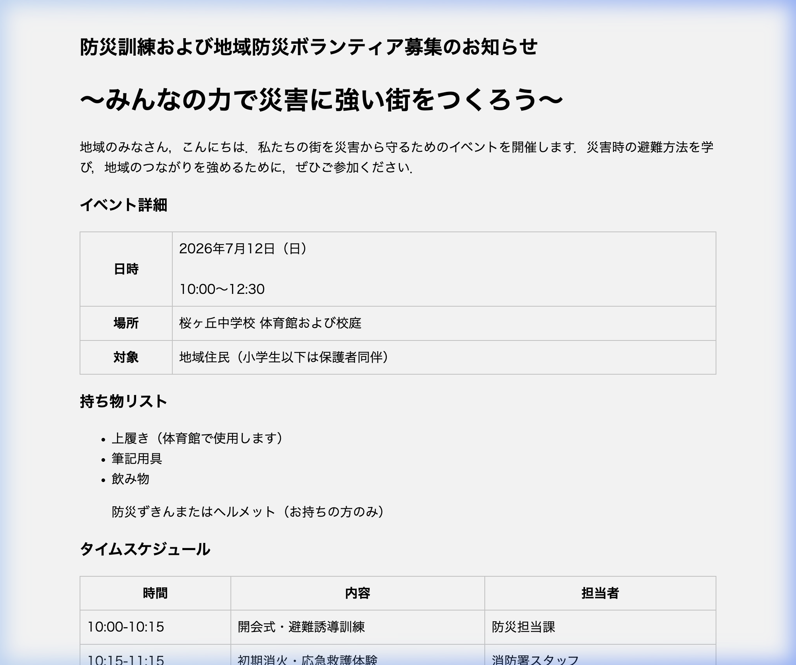

# 情報デザイン第6回実習：伝わらないWebページのリデザイン（ビジュアル編）

この実習では，前回構造化した「避難訓練・防災イベント案内」のWebページにCSSを適用し，情報の優先順位や重要度が直感的に伝わる「ビジュアルデザイン（可視化）」を実装します．

### 📸 初期状態（リデザイン前）のイメージ
以下は，CSSが適用されておらず，HTML構造も崩れている初期状態の表示イメージです．実習を進めてコードを修正していく中で，元がどれほど見づらかったかをこの画像と比較して確認しましょう．



---

## 📖 情報デザインのビジュアル原則（教科書のポイント）

Webページのデザインにおいて，最も重要なのは**「単におしゃれ（装飾）にすることではなく，受け手に対して情報を的確に伝える機能を持たせること」**です．以下の教科書のポイントを意識してCSSを設計しましょう．

### 1．フォントと文字の工夫（可読性・視認性・判読性）
受け手が迷わず，間違えずに読めるように文字をコントロールします．

*   **可読性（読みやすさ）：** 本文は文字が潰れない適切なサイズと行間（CSSの `line-height`）を設定します．
*   **視認性（見つけやすさ）：** タイトルや見出しを大きく・太くし，背景とのコントラストを高めます．
*   **判読性（間違えにくさ）：** 似た文字（「1」と「l」，「0」と「O」など）を区別しやすいフォント（UDフォントや標準的なゴシック体）を採用します．

#### 🅰️ フォント選びの良い例と悪い例
| パターン | 具体例と特徴 | 情報デザイン上の効果・影響 |
| :--- | :--- | :--- |
| **🟢 良い例** | **標準的なゴシック体（`sans-serif` など）**<br>・見出し：大きく太いゴシック体（ジャンプ率を高める）<br>・本文：標準的な太さのゴシック体 | **可読性・視認性が高い**<br>画面上でも線が潰れず，一目で重要な見出しと本文の「優先順位（対比）」が理解できます． |
| **🔴 悪い例** | **装飾フォント（手書き風・筆書体・極端に細い文字）**<br>・見出し・本文：同じフォントサイズ・同じ細さの文字<br>・ポップ体や筆書体の乱用 | **可読性・判読性が低い**<br>文字の線が潰れて読みにくく，強弱（対比）がないため，どこが重要情報なのか直感的に判別できません． |

---

### 2．配色ルール（4色以内の設計）
色数が多すぎると視線が散らばり，情報が伝わりません．Webサイト全体で使用する色は**「4色以内」**に制限するのが情報デザインの基本です．

| 色の役割 | 目的 | カラーコード例 | カラーチップ |
| :--- | :--- | :--- | :--- |
| **① 背景色** | 読みやすさの土台となる色 | `#ffffff` (白) または `#f8f9fa` (薄いグレー) | `#f8f9fa` |
| **② 文字の基本色** | 本文を読みやすくするための色 | `#2c3e50` (濃い紺) または `#333333` (ダークグレー) | `#2c3e50` |
| **③ メインカラー** | サイトのテーマや印象を決める色（全体の約25%） | `#1b3a4b` (信頼をイメージする濃い紺) | `#1b3a4b` |
| **④ 強調色（アクセント）** | 警告や最重要情報など，最も注目させたい色（全体の約5%） | `#e65100` (注意を引く濃いオレンジ) | `#e65100` |

#### 🎨 配色パターンの良い例と悪い例
*   **🟢 良い例（調和と視覚的誘導）：**
    *   全体が落ち着いたトーン（メイン：紺 `#1b3a4b`）で統一され，最も注目すべき「警告」や「日時」だけに強調色（アクセント：オレンジ `#e65100`）が使われているため，視線が自然に重要な情報へと誘導されます．背景とのコントラスト（明度差）も十分に確保されています．
*   **🔴 悪い例①（コントラスト比の不足による視認性低下）：**
    *   背景が白 `#ffffff` なのに対し，文字の基本色に薄いグレー `#aaaaaa` を指定する．明るさの差（明度差）が小さいため，文字が背景に溶け込んでしまい，視力の弱い人や高齢者には全く読めなくなります．
*   **🔴 悪い例②（ハレーションと多色使いによる情報混乱）：**
    *   メインに純粋な青 `#0000ff`，見出し背景に純粋な緑 `#00ff00`，強調に純粋な赤 `#ff0000` など，原色（彩度の高すぎる色）をそのまま組み合わせる．画面がチカチカして目が疲れるだけでなく，色数が多すぎて何が重要なのか伝わりません．
*   **🔴 悪い例③（色覚多様性への配慮不足）：**
    *   警告文の背景を赤 `#ff0000`，文字を青 `#0000ff` にするような，明度差が小さく色相差のみで区別する配色．一部の色覚タイプの人には背景と文字が同化して見え，判読不能になります．

---

### 3．カラーユニバーサルデザイン（色だけに頼らない強調）
人間の色の見え方は多様です（色覚多様性）．赤と緑の区別が難しい人や，高齢者などすべての人に等しく情報を届けるための配慮が必要です．
*   **色以外の要素の併用：** 「日時」や「警告」といった重要情報を表すとき，**「文字を赤色にするだけ」**というデザインは避けてください．
*   **改善の工夫：** 色を変えるだけでなく，**太字（`font-weight: bold`）にする，下線（`text-decoration: underline`）を引く，境界線（`border`）で囲む，あるいはピクトグラムやアイコン（⚠️，📅，📍など）を横に配置する**といった，複数の視覚的要素を組み合わせます．

---

### 4．レイアウトと余白（近接・整列・視線誘導）
画面のすっきりさと情報の整理は，CSSの余白（`margin` / `padding`）で設計します．
*   **近接（情報のまとまり）：** 関連する情報（例：「日時」の見出しと「2026年7月12日」のデータ）は近くに配置し，異なる情報ブロック（例：「イベント詳細」と「持ち物リスト」）の間には広めのマージン（`margin-bottom`）をあけて区別します．
*   **整列（視線の統一）：** 見出しやテーブルの左端を綺麗に揃えることで，ユーザーの視線が「上から下，左から右（横書きのZパターン・Fパターン）」にスムーズに流れるように誘導します．

---

## 🛠 実習の手順

### Step 1．HTML構造の最終チェックと修正（修正の余地）
配布された `index.html` には，CSSをあてる上で不適切な箇所がいくつか残っています．CSSを書き始める前に，コードを確認して修正してください．
1.  **見出しタグの順序：** `h1` と `h2` などのレベルが逆転していませんか？論理的な階層順（h1 ➔ h2 ➔ h3）に直しましょう．
2.  **不要なタグの削除：** リスト（`ul`）の途中に，箇条書きではないタグが紛れ込んでいませんか？また，表（`table`）のセル内に不要な `<br>` が入っていないか確認しましょう．
3.  **クラス名の追加：** CSSでデザインを当てやすくするために，必要に応じてHTMLの要素にクラス名（`class="xxx"`）を追加してください．

### Step 2．CSSの記述（デザインの実装）
`style.css` にスタイルを書き加えていきます．
1.  **基本の文字と背景：** 読みやすいフォント，背景色，文字の基本色を指定します．
2.  **メインカラーと強調色の適用：** ヘッダーや表の見出しにメインカラーをあて，最重要箇所に強調色を適用します．
3.  **アクセシビリティの確保：** 文字と背景のコントラスト比が十分であること，色だけに頼らない強調ができているか確認します．
4.  **余白の設定：** 各ブロックの間隔（`margin`）や，テーブルのセル内側の余白（`padding`）を調整します．

### Step 3．Gitによる提出と自動評価
1.  AIとのチャット履歴を `copilot-chat-history.json` としてエクスポートします．
2.  ファイルを保存し，Gitの3ステップで提出します：
    ```bash
    git add .
    git commit -m "feat: style index.html"
    git push origin main
    ```
3.  GitHubの「Issues」タブを開き，約1分後に届くAI先生からの自動フィードバックを確認します．赤いバツ（🔴）が出た場合は，アドバイスを読んでコードを修正し，再度コミット＆プッシュしてください．すべて🟢（合格）になるまで繰り返します！
